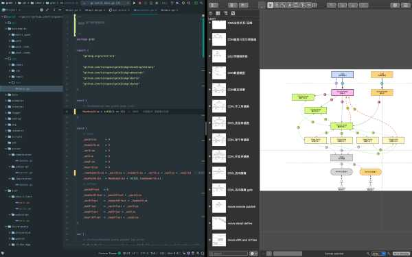
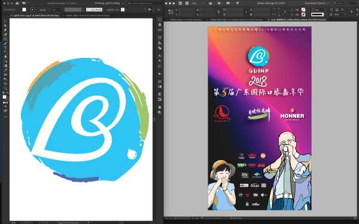
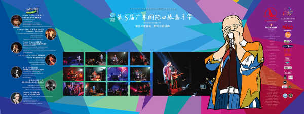

有点意思的话题, 先说个人看法:  

**mac 并不适合编程**

**mac 并不适合编程**

**mac 并不适合编程**
<!--more-->


```
只是, 有些一小小部分人喜欢 mac 用来编程,
而事实是, 绝大多数编程的朋友, 用的 pc, 比如 windows , 比如 linux 
 就像以前有人说, thinkpad 是商务专用,但也有人用来作平面设计, 比如我
```

------

```
mac 适合艺术创作类工作, 比如绘画相关的平面设计, 摄影, 影像后期, 音频/音乐制作.
---------- 三明智(对的, 我说的)
```

------

下面, 点对点说一说: 

1.为什么说起Xcode大家都说远比不上VS，但是说起编程都说OSX比Win好？我暂时粗浅的理解是写代码不就是用这些Ide么，ide都差了为什么还说她适合编程？

```
多年以前, 并没有什么 app store , mac store , 后来, 苹果搞出来 app store / mac store , 
有人在 IOS 上写软件挣到些钱了, 并被人宣传
所以, Xcode 再难用也得用, 能挣钱不是......

另外, 编程用不用 IDE , 这事讨论太多, 不引战了.
我想说的是, 编程本身与 IDE 没什么因果关系, 有没有IDE 都一样可以编程. 
只是适合的 IDE 可能让写代码提高点效率, 罢了.
```



2.为什么OSX明明诸多不方便，特别是软件兼容上好多重要的软件都不支持，支持了也偷工减料，还那么多人喜欢OSX？ 

```
 软件兼容上好多重要的软件都不支持, 哪些重要软件? 这些重要软件指的是 m$office 吗? 
这不是 mac 的罪.
mac 本来就没几个人用, 是一小众产品

那些题主认为的重要软件, 都不为 mac 开发软件, 这与 mac 有什么关系.
多年前, 很多年前, 印刷行业的不少"重要软件", 并不支持 windows , 
那些广告公司还不是一样以高出 PC 3倍以上的价格购买
更不谈那些 sgi 图形工作站一类的图像建模这一类行业软件了 

世界是多样化的, 如果挣钱是快乐的一种, 电脑用得爽是快乐的一种,
那快乐有无数种, 每个人都有自己选择的快乐.

OSX 很小众, 别把它太当回事.
能不用,尽量别去用. 
要不然, 少了很多折腾的乐趣, 比如杀毒, 玩游戏, 分析木马样本, 破解.....
并且可能会花不少钱, 比如购买正版软件的钱啦, 购买 mac 那一堆很贵的附件的事啦....

就像有朋友说, pc 多好啊, 这么多破解软件, 随便用............
说到这一点, 我很吃惊, 我也是写软件挣钱养家的, 破解软件这类事多了, 
写软件的朋友们, 饭碗都没了, 学编程只是爱好? 
不是每个写软件的朋友家里都有矿的, 别再用破解软件了, 给兄弟们一条活路, 好吗?......
.........
.........
```

3.我承认多手势操作挺爽的，浏览网页挺爽的，键盘手感挺爽的。但感觉OSX虽然比Win有这些优点，但最重要的需求却没支持到，为什么还那么多人喜欢OSX？

```
 没几个人喜欢 mac , 真的. 去看看统计数据就好了. 
当然, 我除外, 我喜欢 mac , 我的房子车子, 都是靠mac 挣来的
(不管是曾经的平面设计, 摄影还是软件开发), 
mac 是我挣钱的工具, 用了几十年了, 我不说喜欢也不太好, 是吧.

当然了, PC 我也用了几十年了, 从8086到奔腾, 再.....至强............
```



4.请问Surface Pro3适合编程么？（VS运行是否流畅，键盘手感，大小是否合适）如果不适合请问什么Win本比较适合编程？

```
编程? 是什么编程.......这范围太广泛了. 
例如说, IOS 编程, 你要用一台 windows 电脑并能不用 macOS 操作系统, 
那你一定是年薪500万的牛人了.

VS 运行是否流畅........... 好吧, 说到 VS , 简单来说, 能运行 VS 的本本都适合编程, 
不管多难用, 能挣钱或能出成果的编程用的电脑, 都是好电脑, 与手感, 流畅无关.

编程, 并不像平面设计, 影像制作, 音乐制作, 很多时候时间卡得特别紧张
电脑慢了, 软件不合适了, 交不了活.
软件开发, 也就通常说的编程, 软件设计至少占1/3时间, 
真正在电脑上写代码, 编译,调试..........花的时间并不多

很多年以前, 我用 3D studio , 啃坏了一本3厘米厚的中英双语字典, 苦得不行了, 
但我的作品比别人拿的钱多一倍多, 钱到手时, 我很开心, 家人也很开心, 没人提起过我曾经的苦.

很多年以前, 我10个月啃完了 oracle 数据库那多达15kg 的所有技术说明书, 完成了工作,
我也很开心, 能挣钱的, 都是好电脑, 都是好工具.

Surface pro3 适合编程吗? 我想, 应该是适合的.
但, 这么贵, 钱都花在屏幕上了( surface pro3 的屏幕特别特别好) , 
何不换一台 内存16G 以上, 硬盘是1T SSD 的其他型号电脑? 
```


最后, 

我的工具们

```
主力机:
macbook pro 15寸, 2015版顶配, 16G内存, 1T SSD (购买于2016年底)

软件:  
jetbrains idea / datagrip / goland / webstorm ,   omni graffle ,  
capture one pro 12 , adobe indesign / photoshop / illustrator,
logic pro / ableton live suit 10
pages , keynote,
m$ word 


备机:
thinkpad x1 carbon 顶配( 购买于2016年初)

其他:
ipad pro + 笔, 软件用 procreate 
fujifile x100f / leica m6 / ebony 45ti
```

以上, 祝愉快.


补1: 有朋友问我的付费情况

1. 我的 adobe 算是半正版的, 按月付费, 用到时就付月租费, 平时不用就停掉付费. 毕竟, 这个软件全家桶年费太贵, 现在基本很少用了.
2. 我的 jetbrains 与 M$ 全家桶都是付费软件, 用得多, 也不贵
3. 其他必须的软件, 不贵, 比如 secureCRT, capture one pro , graffle ........
4. 特别提醒, 学生与教师, 很多软件是有优惠的, 当然, 电脑也有优惠, 自行查询申请吧

补2: 有朋友私信, 补几个图:




右填色人物为 ipad pro 上的 procreate 画的, 图中央的照片在深圳演唱会现场拍摄


深圳现场, 与大师合影